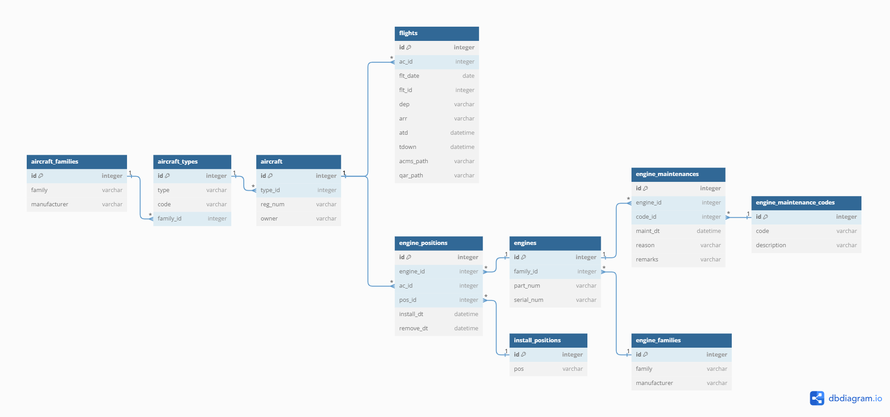

## HW01 Проектирование БД

### Примеры бизнес задач
🛩️ Приложение мониторинга технического состояния самолетов и двигателей:

Для обеспечения безопасности полетов, предотварщения поломок и аварий инженерам по эксплуатации необходимо следить за техническим состоянием парка самолетов. Приложение мониторинга может включать в себя модуль аналитики, где выполняется анализ полетных данных, и модуль технических обслуживаний.

🛩️ Приложение отслеживания и планирования технических обслуживаний и ремонтов:

Приложение может являться единой системой учета, в которую инженеры по эксплуатации вносят проведенные ремонтные работы. Приложение может включать в себя модуль оптимизации расписания ТО, который выдает рекомендации на основе данных о состоянии двигателей и проводимых ремонтных работах.

### Схема базы данных

### Описание таблиц
#### aircraft_families
Описание: таблица семейств самолетов (например, среднемагистральные узкофюзеляжные самолеты A320 компании AIRBUS)

| Поле         | Описание               | Пример |
|--------------|------------------------|--------|
| id           | номер записи           | 1      |
| family       | семейство              | A320   |
| manufacturer | компания производитель | AIRBUS |

#### aircraft_types
Описание: таблица типов самолетов (модификаций в рамках одного семейства)

| Поле      | Описание                    | Пример  |
|-----------|-----------------------------|---------|
| id        | номер записи                | 1       |
| type      | название модификации (типа) | A320NEO |
| code      | краткое обозначение типа    | 32N     |
| family_id | id семейства                | 1       |

#### aircraft
Описание: таблица самолетов

| Поле    | Описание                     | Пример   |
|---------|------------------------------|----------|
| id      | номер записи                 | 1        |
| type_id | id типа                      | A320NEO  |
| reg_num | регистрационный номер борта  | RA-77734 |
| owner   | собственник борта (компания) | Utair    |

#### flights
Описание: таблица полетов

| Поле      | Описание                              | Пример                                                   |
|-----------|---------------------------------------|----------------------------------------------------------|
| id        | номер записи                          | 1                                                        |
| ac_id     | id самолета                           | 1                                                        |
| flt_date  | дата полета                           | 2024-03-01                                               |
| flt_id    | номер рейса                           | 1012                                                     |
| dep       | IATA код аэропорта отправления        | SVO                                                      |
| arr       | IATA код аэропорта прибытия           | IST                                                      |
| atd       | время отправления по расписанию (UTC) | 2024-03-01 12:30:00                                      |
| tdown     | время прибытия по расписанию (UTC)    | 2024-03-01 15:00:00                                      |
| acms_path | путь к ACMS отчету в хранилище        | /acms/2024/32N/RA_77734/RA-77734_1012_240301.txt         |
| qar_path  | путь к QAR отчету в хранилище         | /qar/2024/32N/RA_77734/RA-77734_1012_240301.parquetgzip  |

#### engine_families
Описание: таблица семейств двигателей

| Поле         | Описание               | Пример       |
|--------------|------------------------|--------------|
| id           | номер записи           | 1            |
| family       | семейство              | CFM56-5B     |
| manufacturer | компания производитель | GE/Safran AE |

#### engines
Описание: таблица двигателей

| Поле       | Описание                                           | Пример      |
|------------|----------------------------------------------------|-------------|
| id         | номер записи                                       | 1           |
| part_num   | партийный номер                                    | CFM56-5B3/P |
| serial_num | серийный номер                                     | 14562670    |
| status     | информация о текущем состоянии (на крыле/запасной) | ONWING      |

#### install_positions
Описание: таблица позиций установки двигателя на крыле

| Поле | Описание     | Пример |
|------|--------------|--------|
| id   | номер записи | 1      |
| pos  | позиция      | LEFT   |

#### engine_positions
Описание: таблица истории установки двигателей

| Поле       | Описание                                 | Пример              |
|------------|------------------------------------------|---------------------|
| id         | номер записи                             | 1                   |
| engine_id  | id двигателя                             | 1                   |
| ac_id      | id самолета                              | 1                   |
| pos_id     | id позиции                               | 1                   |
| install_dt | дата и время установки                   | 2021-10-11 18:30:00 |
| remove_dt  | дата и время снятия (null, если не снят) | 2021-10-11 18:30:00 |

#### engine_maintenance_codes
Описание: таблица обозначений технических обслуживаний двигателей

| Поле        | Описание                   | Пример            |
|-------------|----------------------------|-------------------|
| id          | номер записи               | 1                 |
| code        | краткое обозначение работы | W10200            |
| description | описание работы            | ENGINE WATER WASH |

#### engine_maintenances
Описание: таблица технических обслуживаний двигателей

| Поле      | Описание                | Пример                    |
|-----------|-------------------------|---------------------------|
| id        | номер записи            | 1                         |
| engine_id | id двигателя            | 1                         |
| code_id   | id работы               | 1                         |
| maint_dt  | время и дата выполнения | 2023-12-11 10:30:00       |
| reason    | описание                | WO10000-ENGINE WATER WASH |
| remarks   | комментарии             | RESULT IS OK              |

### Возможные улучшения БД
- Оптимизация типов полей, например, ограничение длины varchar -> varchar(20) для поля семейство самолетов.
- Создание отдельной таблицы производителей самолетов.
- Создание отдельной таблицы производителей двигателей.
- Создание отдельной таблицы владельцев самолетов.
- Создание отдельной таблицы статусов двигателей.
- Создание отдельной таблицы рейсов.
- Использование кода ремонтной работы как уникального идентификатора.
- Использование серийного номера двигателя как уникального идентификатора.
P.S.: для бортов использование регистрационного номера как уникального идентификатора невозможно, так как он может измениться.
P.S.2: маловероятно, но возможна смена владельца борта (продажа другой компании), поэтому возможно отслеживание временного периода владения.
