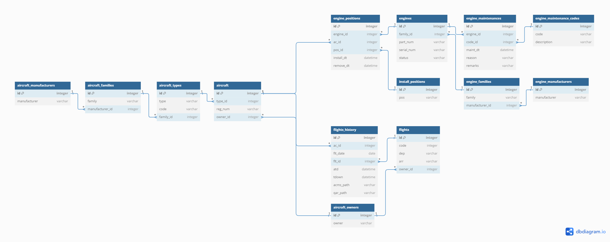

## HW02 Применение индексов и ограничений

### Схема базы данных

### Описание таблиц
#### aircraft_manufacturers
Описание: таблица компаний производителей самолетов

Примечание: улучшение БД из HW01

| Поле         | Описание               | Пример | Ограничения      |
|--------------|------------------------|--------|------------------|
| id           | номер записи           | 1      | PK               |
| manufacturer | компания производитель | AIRBUS | NOT NULL, UNIQUE |

#### aircraft_families
Описание: таблица семейств самолетов (например, среднемагистральные узкофюзеляжные самолеты A320 компании AIRBUS)

| Поле            | Описание                  | Пример | Ограничения      |
|-----------------|---------------------------|--------|------------------|
| id              | номер записи              | 1      | PK               |
| family          | семейство                 | A320   | NOT NULL, UNIQUE |
| manufacturer_id | id компании производителя | 1      | FK               |

#### aircraft_types
Описание: таблица типов самолетов (модификаций в рамках одного семейства)

| Поле      | Описание                    | Пример  | Ограничения      |
|-----------|-----------------------------|---------|------------------|
| id        | номер записи                | 1       | PK               |
| type      | название модификации (типа) | A320NEO | NOT NULL, UNIQUE |
| code      | краткое обозначение типа    | 32N     | NOT NULL, UNIQUE |
| family_id | id семейства                | 1       | FK               |

#### aircraft_owners
Описание: таблица авиакомпаний

Примечание: улучшение БД из HW01

| Поле  | Описание     | Пример | Ограничения      |
|-------|--------------|--------|------------------|
| id    | номер записи | 1      | PK               |
| owner | авиакомпания | Utair  | NOT NULL, UNIQUE |

#### aircraft
Описание: таблица самолетов

| Поле     | Описание                    | Пример   | Ограничения      |
|----------|-----------------------------|----------|------------------|
| id       | номер записи                | 1        | PK               |
| type_id  | id типа                     | A320NEO  | FK               |
| reg_num  | регистрационный номер борта | RA-77734 | NOT NULL, UNIQUE |
| owner_id | id авиакомпании             | 1        | FK               |

#### flights
Описание: таблица рейсов

Примечание: улучшение БД из HW01

| Поле     | Описание                       | Пример | Ограничения |
|----------|--------------------------------|--------|-------------|
| id       | номер рейса                    | 1      | PK          |
| code     | обозначение рейса              | 1012   | NOT NULL    |
| dep      | IATA код аэропорта отправления | SVO    | NOT NULL    |
| arr      | IATA код аэропорта прибытия    | IST    | NOT NULL    |
| owner_id | авиакомпания                   | 1      | FK          |

#### flights_history
Описание: таблица полетов

| Поле      | Описание                              | Пример                                                  | Ограничения |
|-----------|---------------------------------------|---------------------------------------------------------|-------------|
| id        | номер записи                          | 1                                                       | PK          |
| ac_id     | id самолета                           | 1                                                       | FK          |
| flt_date  | дата полета                           | 2024-03-01                                              | NOT NULL    |
| flight_id | id рейса                              | 1                                                       | FK          |
| atd       | время отправления по расписанию (UTC) | 2024-03-01 12:30:00                                     | NOT NULL    |
| tdown     | время прибытия по расписанию (UTC)    | 2024-03-01 15:00:00                                     | NOT NULL    |
| acms_path | путь к ACMS отчету в хранилище        | /acms/2024/32N/RA_77734/RA-77734_1012_240301.txt        |             |
| qar_path  | путь к QAR отчету в хранилище         | /qar/2024/32N/RA_77734/RA-77734_1012_240301.parquetgzip |             |

#### engine_manufacturers
Описание: таблица производителей двигателей

Примечание: улучшение БД из HW01

| Поле         | Описание               | Пример       | Ограничения      |
|--------------|------------------------|--------------|------------------|
| id           | номер записи           | 1            | PK               |
| manufacturer | компания производитель | GE/Safran AE | NOT NULL, UNIQUE |

#### engine_families
Описание: таблица семейств двигателей

| Поле            | Описание                  | Пример   | Ограничения      |
|-----------------|---------------------------|----------|------------------|
| id              | номер записи              | 1        | PK               |
| family          | семейство                 | CFM56-5B | NOT NULL, UNIQUE |
| manufacturer_id | id компании производителя | 1        | FK               |

#### engine_statuses
Описание: таблица состояний двигателей (например, на крыле/запасной)

Примечание: улучшение БД из HW01

| Поле   | Описание                       | Пример | Ограничения      |
|--------|--------------------------------|--------|------------------|
| id     | номер записи                   | 1      | PK               |
| status | информация о текущем состоянии | ONWING | NOT NULL, UNIQUE |

#### engines
Описание: таблица двигателей

| Поле       | Описание        | Пример      | Ограничения      |
|------------|-----------------|-------------|------------------|
| id         | номер записи    | 1           | PK               |
| part_num   | партийный номер | CFM56-5B3/P | NOT NULL         |
| serial_num | серийный номер  | 14562670    | NOT NULL, UNIQUE |
| status_id  | id статуса      | 1           | FK               |

#### install_positions
Описание: таблица позиций установки двигателя на крыле

| Поле | Описание     | Пример | Ограничения      |
|------|--------------|--------|------------------|
| id   | номер записи | 1      | PK               |
| pos  | позиция      | LEFT   | NOT NULL, UNIQUE |

#### engine_positions
Описание: таблица истории установки двигателей

| Поле       | Описание                                 | Пример              | Ограничения |
|------------|------------------------------------------|---------------------|-------------|
| id         | номер записи                             | 1                   | PK          |
| engine_id  | id двигателя                             | 1                   | FK          |
| ac_id      | id самолета                              | 1                   | FK          |
| pos_id     | id позиции                               | 1                   | FK          |
| install_dt | дата и время установки                   | 2021-10-11 18:30:00 | NOT NULL    |
| remove_dt  | дата и время снятия (null, если не снят) | 2021-10-11 18:30:00 |             |

#### engine_maintenance_codes
Описание: таблица обозначений технических обслуживаний двигателей

| Поле        | Описание                   | Пример            | Ограничения      |
|-------------|----------------------------|-------------------|------------------|
| id          | номер записи               | 1                 | PK               |
| code        | краткое обозначение работы | W10200            | NOT NULL, UNIQUE |
| description | описание работы            | ENGINE WATER WASH |                  |

#### engine_maintenances
Описание: таблица технических обслуживаний двигателей

| Поле      | Описание                | Пример                    | Ограничения |
|-----------|-------------------------|---------------------------|-------------|
| id        | номер записи            | 1                         | PK          |
| engine_id | id двигателя            | 1                         | FK          |
| code_id   | id работы               | 1                         | FK          |
| maint_dt  | время и дата выполнения | 2023-12-11 10:30:00       | NOT NULL    |
| reason    | описание                | WO10000-ENGINE WATER WASH |             |
| remarks   | комментарии             | RESULT IS OK              |             |

### Примеры бизнес задач
🛩️ Приложение мониторинга технического состояния самолетов и двигателей:

Для обеспечения безопасности полетов, предотварщения поломок и аварий инженерам по эксплуатации необходимо следить за техническим состоянием парка самолетов. Приложение мониторинга может включать в себя модуль аналитики, где выполняется анализ полетных данных, и модуль технических обслуживаний.

🛩️ Приложение отслеживания и планирования технических обслуживаний и ремонтов:

Приложение может являться единой системой учета, в которую инженеры по эксплуатации вносят проведенные ремонтные работы. Приложение может включать в себя модуль оптимизации расписания ТО, который выдает рекомендации на основе данных о состоянии двигателей и проводимых ремонтных работах.

### Возможные запросы
Исходя из приведенных примеров бизнес-задач, можно выделить следующие возможные запросы:

* Поиск бортов, входящих в парк самолетов авиакомпании: 
  + по названию авиакомпании.
* Поиск полета/полетов для получения отчетов: 
  + по регистрационному номеру борта, 
  + по номеру рейса, 
  + по дате/датам полета, 
  + по IATA коду/кодам аэропортов, 
  + по нескольким приведенным выше параметрам.
* Поиск серийных номеров двигателей, установленных на самолет: 
  + по регистрационному номеру борта (история установок),
  + по регистрационному номеру борта и дате.
* Поиск ремонтных работ, произведенных над двигателем/двигателями (например, 1 борта): 
  + по серийному номеру двигателя (история ремонтов), 
  + по серийному номеру двигателя и дате/датам, 
  + по регистрационному номеру борта (история ремонтов),
  + по регистрационному номеру борта и дате/датам.
* Создание записи о техническом обслуживании двигателя.

### Анализ кардинальности полей и возможные индексы
Поля *manufacturer* в таблице производителей самолетов и двигателей обладают низкой кардинальностью, так как компаний производителей достаточно мало.
Например, производители самолетов - Boeing, Airbus, Embraer, производители двигателей - GE, Safran, Rolls Royce.

Поле *family* в таблице семейств самолетов также обладает низкой кардинальностью, так как обычно в семейство самолетов входит небольшое число модификаций.
Например, семейство самолетов компании Airbus A320 - A318, A319, A320, A320NEO, A321.

Поле *owner* обладает низкой, так как, скорее всего, к ПО будет подключено небольшое количество заказчиков (авикомпаний).
Например, в России порядка 40 авиакомпаний (без учета бизнес-авиации), и, наиболее вероятно, что только часть из них будет заказчиками ПО.

Поле *reg_num* в таблице самолетов обладает средней кардинальностью, так как у крупных авиакомпаний может быть порядка 300-400 бортов. Каждый борт имеет уникальный регистрационный номер.

Поле *serial_num* в таблице двигателей также обладает средней кардинальностью.
Например, если в парке самолетов авиакомпании 400 бортов, то количество двигателей будет >= 800.

Поле *code* (номер рейса) в таблице полетов скорее всего обладает средней или высокой кардинальностью, в зависимости от того, какой размер парка самолетов авиакомпании/й.

Поля *dep* и *arr* в таблице полетов также, скорее всего, обладают средней кардинальностью, если парк самолетов большой.

Поле *flt_date* в таблице истории полетов обладает высокой кардинальностью.

Поле *code* в таблице технических обслуживаний обладает высокой кардинальностью.
Ввиду технической сложности механизмов, большого количества узлов и агрегатов в самолетах, количество уникальных кодов ремонтных работ может быть большим.

Поле *maint_dt* в таблице истории технических обслуживаний обладает высокой кардинальностью.

Исходя из вероятных запросов к БД и оценки кардинальности полей, возможно назначить индексы на следующие поля:
* *code* или *code-dep*, *code-arr*, *code-dep-arr* (композитный индекс) в таблице flights
* *flt_date* в таблице flights_history
* *code* в таблице engine_maintenance_codes
* *maint_dt* в таблице engine_maintenances
