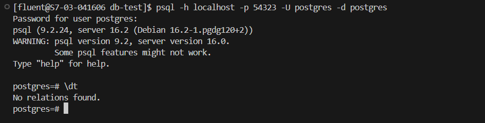
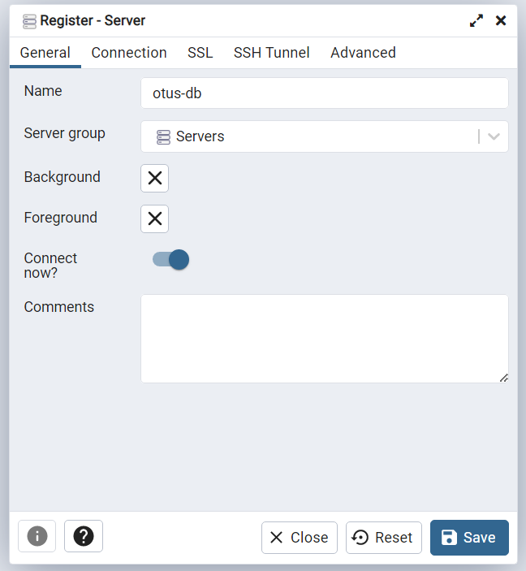
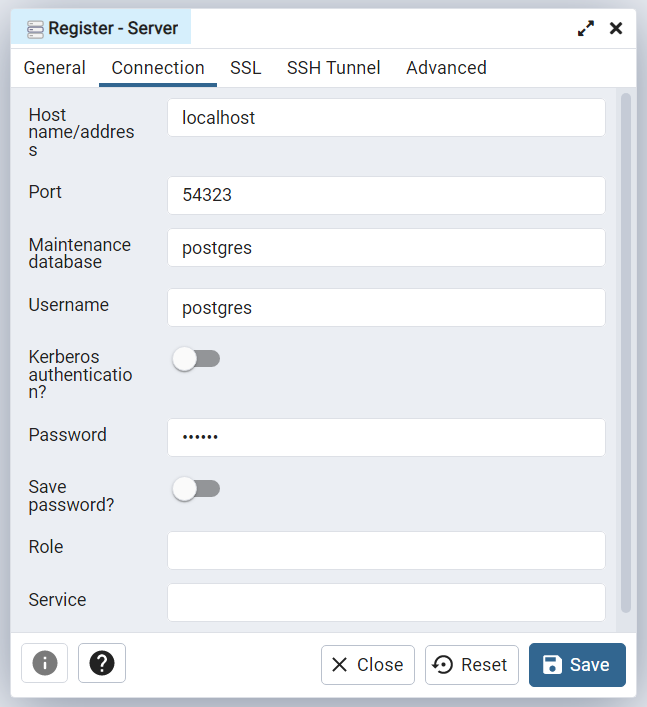
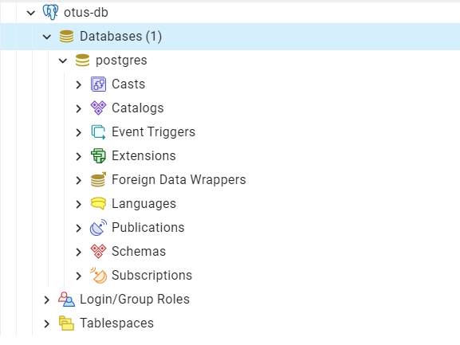

## HW03 Установка СУБД PostgreSQL

### Установка PostgreSQL в Docker
Для установки используем latest образ PostgreSQL и docker-compose. Определяем в docker-compose переменные окружения для создания базы данных PostgreSQL с именем `postgres`, пользователем `postgres` и паролем `qwerty`. 
````
image: postgres:latest
environment:
  POSTGRES_DB: postgres
  POSTGRES_USER: postgres
  POSTGRES_PASSWORD: qwerty
````
Сборка и запуск выполняются командой:
```commandline
docker-compose up --build
```

После успешного запуска контейнера, СУБД будет доступна на localhost:54323.

### Подключение к БД
Для подключения из консоли используем psql:
```commandline
psql -h localhost -p 54323 -U postgres -d postgres
```
Затем вводим пароль `qwerty`.
При успешном выполнении должна появиться командная строка postgres.



Для подключения в pgAdmin необходимо создать сервер:





При успешном выполнении появится активный сервер и БД:



### Остановка контейнера
```commandline
docker-compose down
```